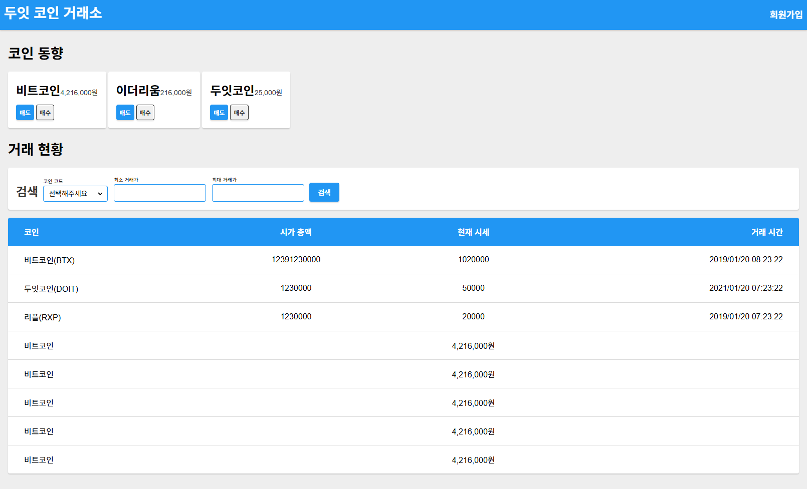

# 두잇! 리액트 시작하기 (Do It React)

React 학습을 위한 실습 프로젝트입니다. "두잇! 리액트 프로그래밍 정석" 교재를 따라 진행한 예제들을 포함하고 있습니다.



## 📋 프로젝트 개요

이 프로젝트는 React의 기본 개념부터 고급 패턴까지 단계별로 학습할 수 있도록 구성된 실습용 예제 모음입니다. 각 챕터별로 다양한 React 기능과 패턴을 다루고 있습니다.

### 현재 실행 중인 애플리케이션

현재 메인 애플리케이션으로 **CoinApp** (가상화폐 거래 관리 앱)이 실행 중입니다. Redux를 사용한 상태 관리와 비동기 API 호출을 포함한 완전한 React 애플리케이션 예제입니다.

## 🛠️ 기술 스택

### Core
- **React** 18.1.0
- **Redux** 4.1.2 (상태 관리)
- **React Redux** 8.0.1
- **React Router DOM** 5.0.0

### 상태 관리 & 미들웨어
- **Redux Thunk** 2.4.1 (비동기 액션)
- **Redux Pack** 0.1.5
- **Reselect** 4.0.0 (선택자 최적화)

### 스타일링
- **SASS** (SCSS 파일 지원)
- **Materialize CSS** (UI 프레임워크)
- **Aphrodite** 2.2.3 (CSS-in-JS)
- **React-with-Styles** 3.2.1

### 개발 도구
- **Storybook** 5.2.6 (컴포넌트 문서화)
- **Enzyme** 3.8.0 (테스팅)
- **Axios** 0.27.2 (HTTP 클라이언트)
- **json-server** 0.14.2 (모킹 서버)
- **Moment.js** 2.24.0 (날짜 처리)

### 빌드 도구
- **Create React App** 2.1.7
- **React Scripts** 2.1.7

## 📁 프로젝트 구조

```
src/
├── 01/              # React 기본 컴포넌트 예제
├── 02/              # JavaScript ES6+ 문법 (모듈, 클로저, 데바운스 등)
├── 03/              # React 컴포넌트 (Props, State, Lifecycle)
├── 04/              # 스타일링 (withStyles, 테마)
├── 05/              # 고차 컴포넌트 (HOC)
├── 06/              # React Router 예제
├── 07/              # Redux 기초 예제
├── 08/              # Redux 실전 프로젝트 (CoinApp)
│   ├── actions/     # Redux 액션
│   ├── components/  # 프레젠테이션 컴포넌트
│   ├── containers/  # 컨테이너 컴포넌트
│   ├── reducers/    # Redux 리듀서
│   ├── middlewares/ # Redux 미들웨어
│   └── store/       # 스토어 설정
├── doit-ui/         # 재사용 가능한 UI 컴포넌트 라이브러리
├── sass/            # SASS 스타일 파일
├── stories/         # Storybook 스토리 파일
└── __tests__/       # 테스트 파일
```

## 🚀 시작하기

### 사전 요구사항

- **Node.js** 10.10.0 이상 (권장: nvm 사용)
- **npm** 또는 **yarn**

### 설치

```bash
# 의존성 설치
npm install
# 또는
yarn install
```

### 개발 서버 실행

```bash
# React 앱 실행 (포트: 3000)
npm start
```

### Mock 서버 실행

CoinApp 개발을 위해 별도 터미널에서 mock 서버를 실행합니다:

```bash
# Mock API 서버 실행 (포트: 4000, 500ms 지연)
npm run mockserver
```

### 기타 스크립트

```bash
# 테스트 실행
npm test

# 프로덕션 빌드
npm run build

# Storybook 실행 (포트: 9001)
npm run storybook

# 에러 시뮬레이션 서버
npm run errorserver
```

## 📚 학습 내용

### 01-02: React 기초
- React 컴포넌트 작성
- JavaScript ES6+ 문법 (모듈, 클로저, 디바운스/스로틀)

### 03: React 컴포넌트 심화
- Props와 State
- 컴포넌트 생명주기 (Lifecycle)
- 이벤트 처리
- 리스트 렌더링

### 04: 스타일링
- CSS-in-JS 패턴
- withStyles 고차 컴포넌트
- 테마 시스템

### 05: 고차 컴포넌트 (HOC)
- HOC 패턴 구현
- 재사용 가능한 로직 분리
- 컴포지션 패턴

### 06: React Router
- 라우팅 설정
- 네비게이션
- 동적 라우팅

### 07: Redux 기초
- Redux 스토어 설정
- 액션과 리듀서
- React-Redux 연결
- 고급 Redux 패턴

### 08: Redux 실전 프로젝트
- **CoinApp**: 가상화폐 거래 관리 애플리케이션
  - Redux로 상태 관리
  - 비동기 API 호출 (redux-thunk)
  - 미들웨어 활용
  - 컨테이너/프레젠테이션 컴포넌트 패턴
  - 모달 및 알림 시스템

## 🧪 테스팅

- Enzyme을 사용한 컴포넌트 테스트
- Jest 테스트 러너
- 테스트 파일 위치: `src/__tests__/`

## 📖 Storybook

컴포넌트를 독립적으로 개발하고 문서화하기 위해 Storybook을 사용합니다:

```bash
npm run storybook
```

브라우저에서 `http://localhost:9001`로 접속하여 컴포넌트를 확인할 수 있습니다.

## ⚙️ 설정 및 문제 해결

### Node.js 버전 관리

이 프로젝트는 Node.js 10.10.0 버전을 권장합니다. nvm을 사용하여 버전을 관리하는 것을 추천합니다.

```bash
# nvm 설치 후
nvm install 10.10.0
nvm use 10.10.0
```

### Redux createStore 취소선 이슈

```bash
npm uninstall redux react-redux
npm install redux@4.1.2 react-redux
```

### node-sass 관련 이슈

```bash
npm uninstall node-sass
cd src
yarn add node-sass@4.14.0
npm rebuild node-sass
```

자세한 설정 및 문제 해결 내용은 `react시행착오.txt` 파일을 참고하세요.

## 📝 주요 기능

### CoinApp (현재 실행 중인 앱)

- **CoinOverview**: 가상화폐 현황 대시보드
- **TransactionList**: 거래 내역 목록 및 검색
- **TradeCoin**: 가상화폐 거래 기능
- **Notification**: 알림 시스템
- **Modal**: 모달 시스템

### UI 컴포넌트 라이브러리 (doit-ui)

재사용 가능한 컴포넌트들:
- Button, Input, Select
- Card, Table, Modal
- Toast, Form 컴포넌트
- 테마 시스템

## 🤝 기여

이 프로젝트는 학습 목적으로 만들어졌습니다. 개선 사항이나 버그가 있다면 이슈를 등록해 주세요.

## 📄 라이선스

이 프로젝트는 학습 목적으로 사용됩니다.

## 📚 참고 자료

- [React 공식 문서](https://reactjs.org/)
- [Redux 공식 문서](https://redux.js.org/)
- [Create React App 문서](https://facebook.github.io/create-react-app/docs/getting-started)
- "두잇! 리액트 프로그래밍 정석" 교재

---

**Note**: 프로젝트 폴더 위치를 변경하면 상위 항목들을 다시 설치해야 할 수 있습니다.
