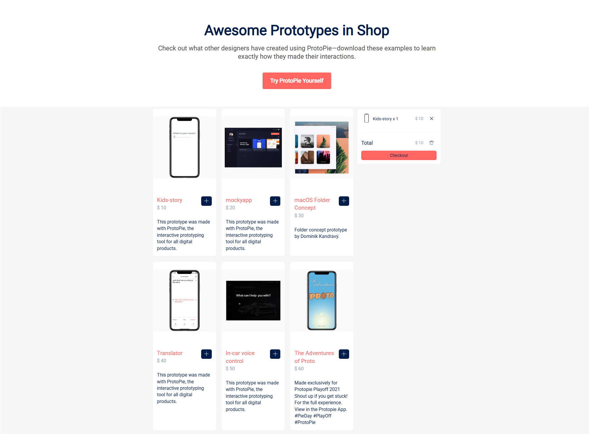

# React Shopping Mall

ProtoPie 프로토타입을 판매하는 React 쇼핑몰 애플리케이션입니다.

## 📋 프로젝트 소개

이 프로젝트는 ProtoPie로 제작된 인터랙티브 프로토타입들을 구매할 수 있는 쇼핑몰 웹 애플리케이션입니다. React Context API를 활용한 상태 관리, 장바구니 기능, 실시간 가격 계산 등의 기능을 포함하고 있습니다.



## ✨ 주요 기능

- **프로토타입 목록 조회**: ProtoPie로 제작된 다양한 프로토타입들을 확인할 수 있습니다
- **장바구니 기능**: 원하는 프로토타입을 장바구니에 추가/삭제할 수 있습니다
- **수량 관리**: 동일한 프로토타입을 여러 번 추가할 수 있으며, 수량이 자동으로 증가합니다
- **실시간 가격 계산**: 장바구니의 총 금액이 실시간으로 계산되어 표시됩니다
- **비디오 썸네일**: 각 프로토타입의 미리보기 비디오를 확인할 수 있습니다

## 🛠️ 기술 스택

- **React** 17.0.2
- **React DOM** 17.0.2
- **React Scripts** 5.0.0
- **Context API**: 전역 상태 관리
- **Custom Hooks**: 재사용 가능한 로직 분리

## 📁 프로젝트 구조

```
react-shopping-mall/
├── public/
│   ├── index.html
│   └── ...
├── src/
│   ├── components/          # 컴포넌트
│   │   ├── Header.jsx       # 헤더 컴포넌트
│   │   ├── Prototypes.jsx   # 프로토타입 목록 컴포넌트
│   │   ├── Orders.jsx       # 장바구니 컴포넌트
│   │   └── Footer.jsx       # 푸터 컴포넌트
│   ├── contexts/            # Context 정의
│   │   └── AppStateContext.jsx
│   ├── providers/           # Context Provider
│   │   └── AppStateProvider.jsx
│   ├── hooks/               # Custom Hooks
│   │   ├── usePrototypes.js # 프로토타입 데이터 훅
│   │   ├── useOrders.js     # 주문 데이터 훅
│   │   └── useActions.js    # 액션 훅
│   ├── App.js               # 메인 앱 컴포넌트
│   ├── App.css              # 앱 스타일
│   ├── index.js             # 엔트리 포인트
│   └── index.css            # 전역 스타일
├── package.json
└── README.md
```

## 🚀 시작하기

### 필수 요구사항

- Node.js (v14 이상)
- npm 또는 yarn

### 설치 방법

1. 저장소 클론
```bash
git clone [repository-url]
cd react-shopping-mall
```

2. 의존성 설치
```bash
npm install
```

3. 개발 서버 실행
```bash
npm start
```

브라우저에서 [http://localhost:3000](http://localhost:3000)으로 접속하면 애플리케이션을 확인할 수 있습니다.

## 📜 사용 가능한 스크립트

프로젝트 디렉토리에서 다음 명령어들을 실행할 수 있습니다:

### `npm start`

개발 모드로 앱을 실행합니다.\
브라우저에서 [http://localhost:3000](http://localhost:3000)로 접속하면 확인할 수 있습니다.

코드 변경 시 페이지가 자동으로 리로드되며, 콘솔에 린트 오류가 표시됩니다.

### `npm test`

인터랙티브 모드로 테스트 러너를 실행합니다.\
자세한 내용은 [테스트 실행하기](https://facebook.github.io/create-react-app/docs/running-tests)를 참고하세요.

### `npm run build`

프로덕션용으로 앱을 빌드합니다.\
`build` 폴더에 최적화된 프로덕션 빌드가 생성됩니다.

빌드는 압축되고 파일명에 해시가 포함됩니다.\
프로덕션 배포 준비가 완료되었습니다!

배포에 대한 자세한 내용은 [배포하기](https://facebook.github.io/create-react-app/docs/deployment)를 참고하세요.

### `npm run eject`

**경고: 이 작업은 되돌릴 수 없습니다!**

만족스럽지 않은 빌드 도구와 설정이 있다면 언제든지 `eject`할 수 있습니다. 이 명령은 프로젝트의 단일 빌드 의존성을 제거합니다.

대신 모든 설정 파일과 전이 의존성(webpack, Babel, ESLint 등)을 프로젝트로 복사하여 완전한 제어권을 제공합니다.

## 🏗️ 주요 컴포넌트 설명

### AppStateProvider
전역 상태를 관리하는 Context Provider입니다. 프로토타입 목록과 주문 정보를 관리하며, 다음과 같은 액션을 제공합니다:
- `addToOrder`: 장바구니에 프로토타입 추가
- `remove`: 장바구니에서 특정 항목 제거
- `removeAll`: 장바구니 전체 비우기

### Prototypes
프로토타입 목록을 보여주는 컴포넌트입니다. 각 프로토타입의 썸네일 비디오, 제목, 가격, 설명을 표시하며, '+' 버튼을 통해 장바구니에 추가할 수 있습니다.

### Orders
장바구니를 표시하는 컴포넌트입니다. 추가된 프로토타입들의 목록, 수량, 가격을 보여주며, 총 금액을 계산하여 표시합니다. 개별 항목 삭제 및 전체 삭제 기능을 제공합니다.

## 📚 커스텀 훅

### usePrototypes
프로토타입 데이터를 가져오는 훅입니다.

### useOrders
주문(장바구니) 데이터를 가져오는 훅입니다.

### useActions
상태 변경 액션(addToOrder, remove, removeAll)을 가져오는 훅입니다.

## 🔗 관련 링크

- [React 공식 문서](https://reactjs.org/)
- [Create React App 문서](https://facebook.github.io/create-react-app/docs/getting-started)
- [ProtoPie 공식 사이트](https://www.protopie.io)

## 📄 라이선스

이 프로젝트는 개인 학습 목적으로 제작되었습니다.
